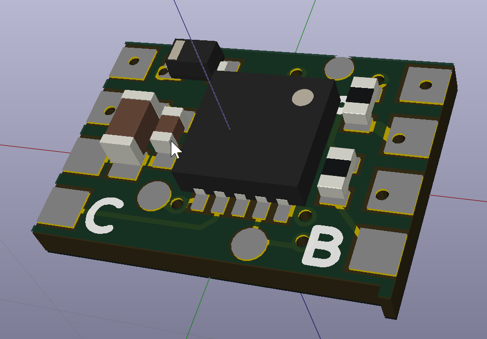
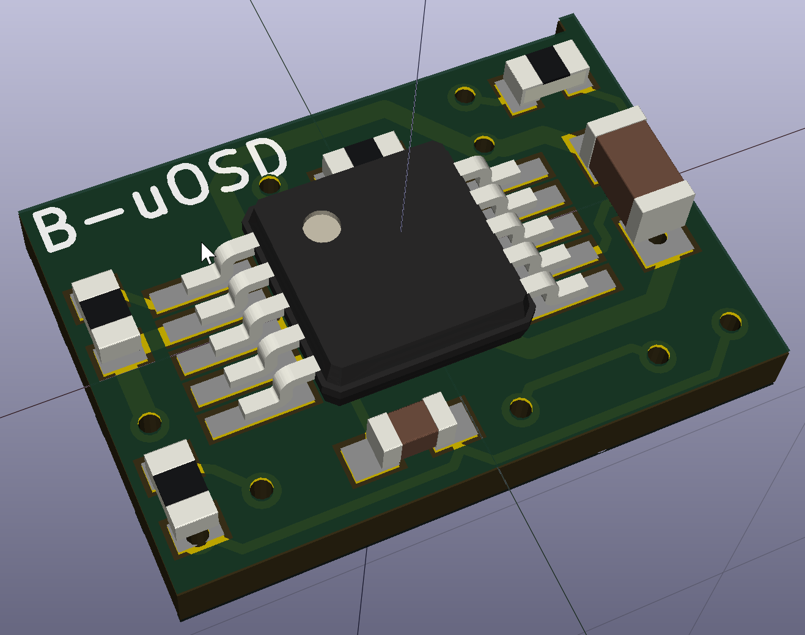
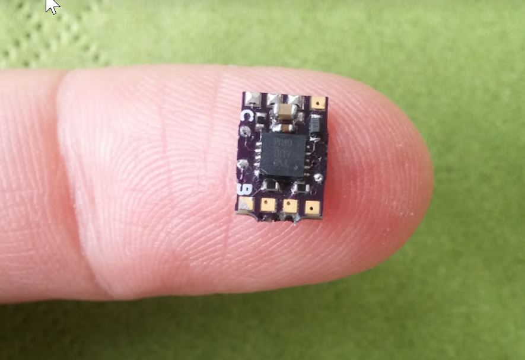
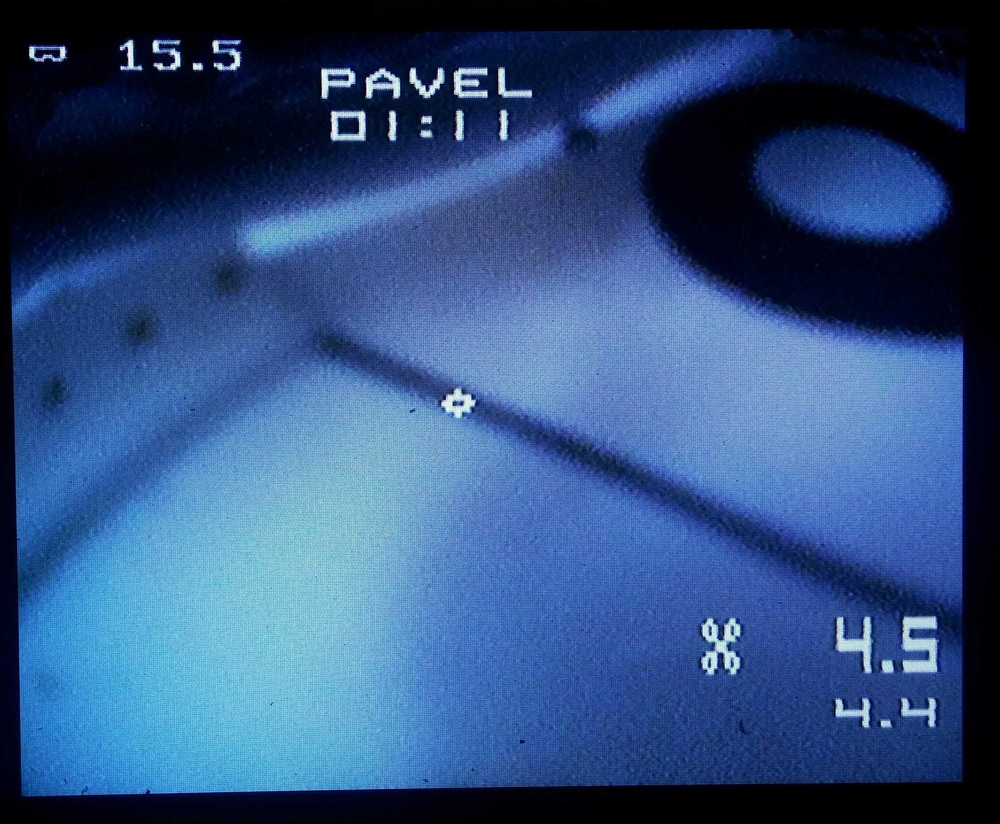
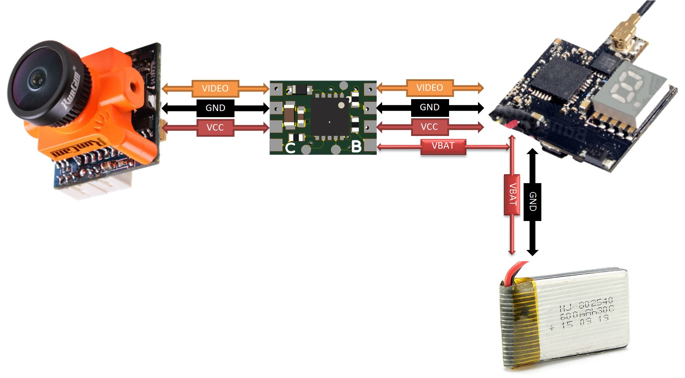
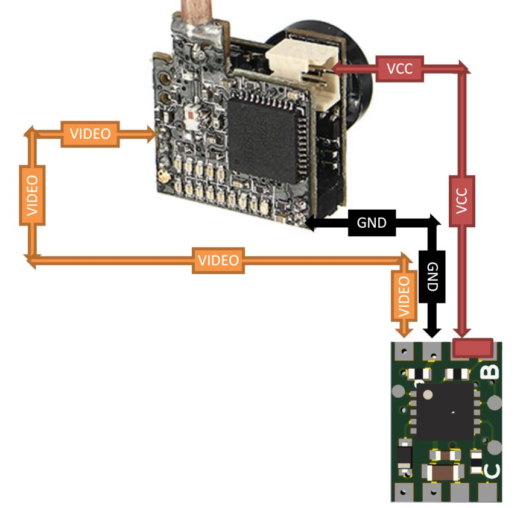
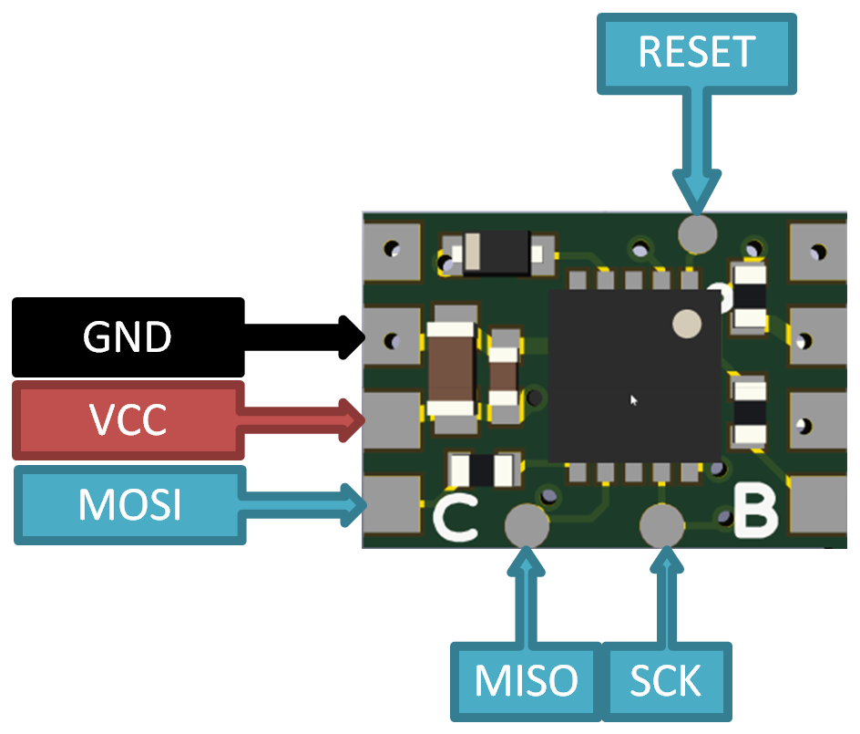

# Battery voltage microOSD v1.2
Very small and simple OSD for monitoring Battery voltage. It is useful for AIO micro cameras, FPV helmet etc.

The PCB is very small. Can be ordered at OshPark: https://oshpark.com/shared_projects/nvOy0lBm



## Functionality
- Supports 1S-4S battery monitoring. (Changing onboard voltage divider can be extended for bigger batteries.)
- Adjustable text position.
- Shows current voltage and minimal detected voltage.
- Pilot name, Crosshair and timer.
- Voltage blinking if battery running low.
- Supply voltage 3.3-5.5v.
- Low supply current, no heat generation.
- It is very small size (8.8mm X 6mm).
- Virtually weights nothing.
- Configurable parameters via compiling.

It has minuses too.
- Due to small and slow mcu (no special mcu for signal generation) the OSD picture is not as stable as other bigger OSDs.
- No shadow around the symbols (not visible on white background). Planned it rhe future releases.

Discussion is here: https://www.rcgroups.com/forums/showthread.php?2985720-uOSD-World-smallest-micro-OSD

Some screenshots:



## Connection
There is many possibilities to use this OSD.
One example for 1S setup:


Another example for AIO combo camera/vtx 1S setup:


## Compilation
To compile source files there is several options.
### Under Linux (even cheap OrangePi board will work)
Install `avra` and `git`
```
apt-get install avra git
```
Clone the project to any directory
```
git clone https://github.com/nppc/B-uOSD.git
```
Navigate to `Bin` directory
```
cd B-uOSD/Bin
```
And run `compile_linux.sh` script
```
./compile_linux.sh
```
Now you have .hex file.

### Under Windows
Project can be compiled with AVRASM2 (similar to avra on Linux) or with AVR Studio.

## Flashing
Use `avrdude` software and `USBASP` dongle for flashing microcontroller. 

```
avrdude.exe -c usbasp -p t13 -P usb -B 4.0 -U flash:w:B-uOSD_vXX.hex:a
```
