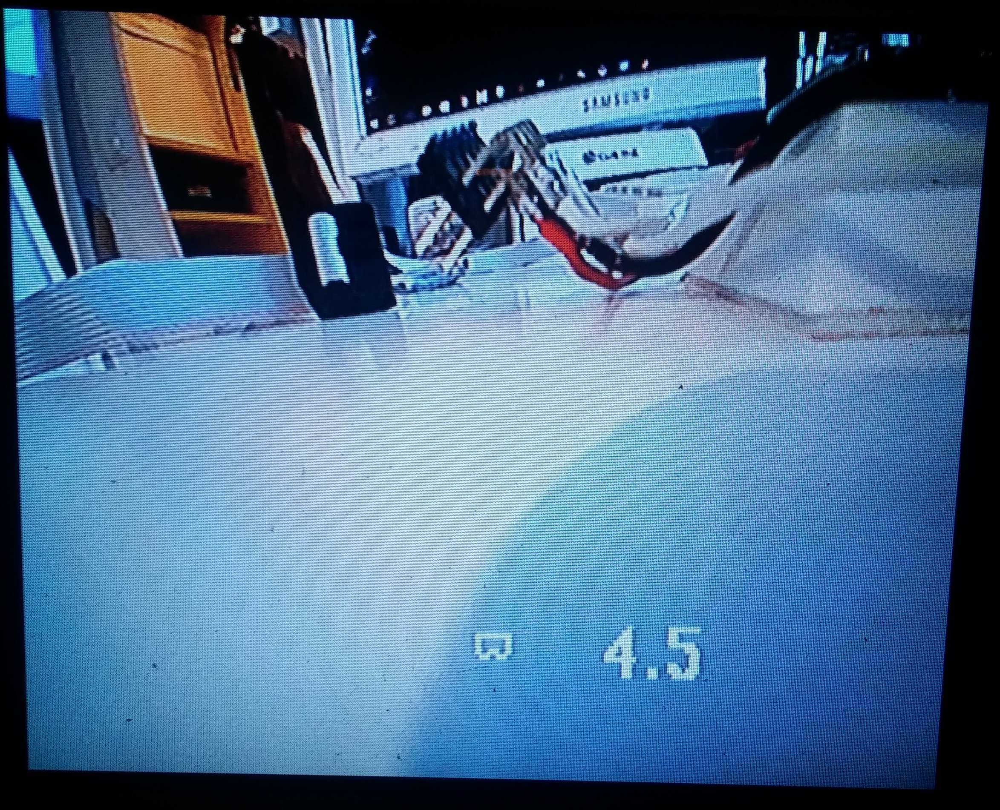
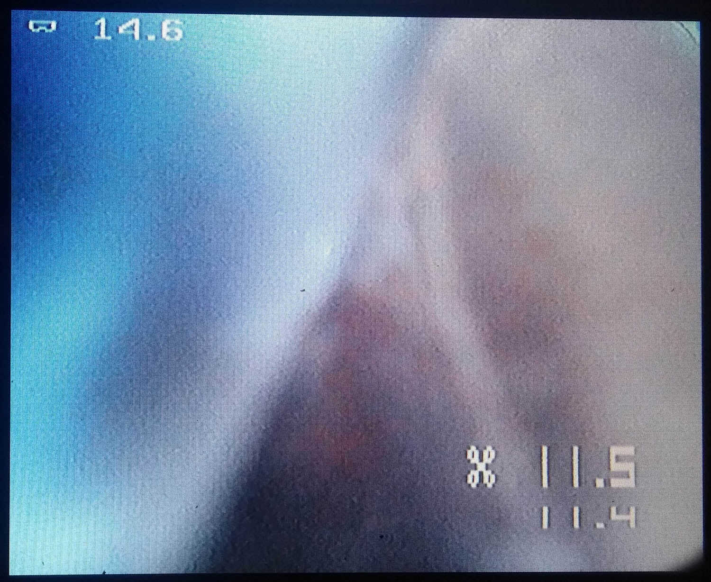

# Battery voltage microOSD v1.2
Very small and simple OSD for monitoring Battery voltage. It is useful for AIO micro cameras, FPV helmet etc.

The PCB is very small. Can be ordered at OshPark: https://oshpark.com/shared_projects/nvOy0lBm


## Functionality
- Supports 1S-4S battery monitoring. (Changing onboard voltage divider can be extended for bigger batteries.)
- Adjustable text position.
- Shows current voltage and minimal detected voltage.
- Voltage blinking if battery running low.
- Supply voltage 3.3-5.5v.
- Low supply current, no heat generation.
- It is very small size (8.8mm X 6mm).
- Virtually weights nothing.
- Configurable parameters via Serial.

It has minuses too.
- Very basic (only one voltage monitoring)
- Due to small and slow mcu (no special mcu for signal generation) the OSD picture is not as stable as other bigger OSDs.
- No shadow around the symbols (not visible on white background).

Some screenshots:


One OSD in Helmet, other in Copter. New square font.


## Connection
There is many possibilities to use this OSD.
One example for 1S setup:


Another example for AIO combo camera/vtx 1S setup:


## Configuration
There is (C)onfiguration pin. BAUDRATE is 19200.
### Connection for configuring
Connect to PC or tablet with any USB2Serial converter. Connect 3 wires: 

B-uOSD | USB2Serial
----------- | ------------
VCC | VCC
GND | GND
C | TX

OSD can be connected to the video signal to see changes on screen in live.
### Changing configuration
1. To enter to configuration mode, type in terminal UUU and press enter. OSD will disappear from the screen.
2. Enter any of the commands. After changing any parameter OSD will come back to the screen for 4 seconds.
3. When you satisfied with the changes, save them to EEPROM.
### Available commands
Every command has 4 characters
- **XXXX** - Exit from Configuration mode without saving changes to EEPROM (after power cycle current settings will be lost).
- **SSSS** - Save settings to the EEPROM and exit from Configuration mode (after power cycle new settings will be applied).
- **FFFF** - Restore Factory settings and reboot device.
- **TTTT** - Test settings. Show OSD on screen for 4 seconds in Configuration mode.
- **Lnnn** - Set the *line* where voltage will be printed. nnn number in format 000. Useful range is about 030 to 280.
- **Cnnn** - Set the *column* where voltage will be printed. nnn number in format 000. Useful range is about 001 to 130.
- **Vsnn** - Adjust voltage and exit from Configuration mode. You can adjust it if OSD battery voltage is a bit different from real battery voltage. snn number in format [sign]00. In place of [sign] can be used '-' or '0' indicating sign of number. Allowed range is -99 to 099. 1=100mV (if you enter V-05, OSD voltage will be reduced for 500mV). 
- **Wnnn** - Set low voltage threshold. If voltage drops below this value, OSD voltage will blink. nnn number in format 000. Allowed range is 001 to 254.

## Compilation
To compile source files there is several options.
### Under Linux (even cheap OrangePi board will work)
Install `avra` and `git`
```
apt-get install avra git
```
Clone the project to any directory
```
git clone https://github.com/nppc/B-uOSD.git
```
Navigate to `Bin` directory
```
cd B-uOSD/Bin
```
And run `compile_linux.sh` script
```
./compile_linux.sh
```
Now you have .hex files with all possible compile variations ready to flash:

File name | Options
----------- | ------------
B-uOSD_NC_vXX.hex | Normal font size, Copter bitmap
B-uOSD_NG_vXX.hex | Normal font size, Googles bitmap
B-uOSD_DC_vXX.hex | Double font size, Copter bitmap
B-uOSD_DG_vXX.hex | Double font size, Googles bitmap

### Under Windows
Project can be compiled with AVRASM2 (similar to avra on Linux) or with AVR Studio.

## Flashing
Use `avrdude` software and `USBASP` dongle for flashing microcontroller. 

```
avrdude.exe -c usbasp -p t13 -P usb -B 4.0 -U flash:w:B-uOSD_NC_vXX.hex:a
```
